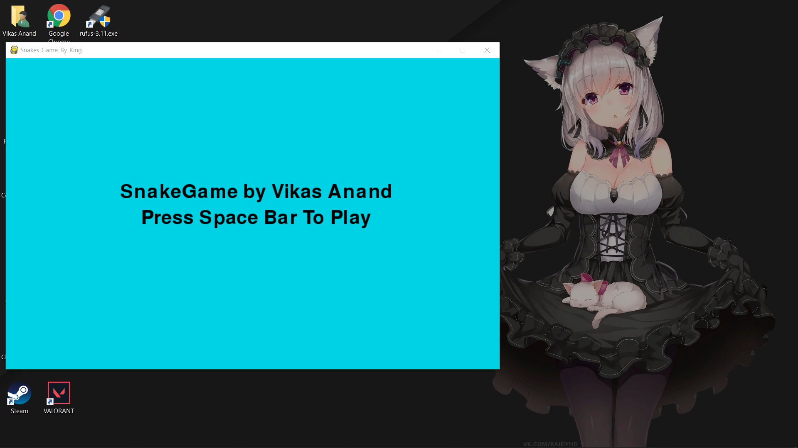
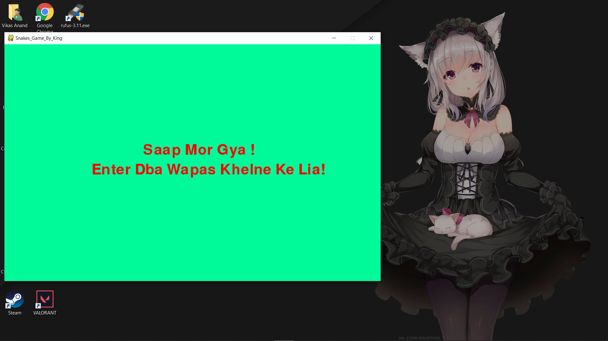

# Snake Game By King

### A snake game written in Python using the PyGame library.

## Installation

* Install Latest Python From [Python](https://www.python.org/downloads/)
* Open Your Terminal/Cmd.
* Type `pip install pygame/ pip3 install pygame`
* `git clone https://github.com/kingcoolvikas/SnakeGameByKing.git`
* cd SnakeGameByKing
* python3 snake.py

### Running the Application

* Just Download this whole Repository as _.zip_ format.  
* Then run _snake.py_ with your favourite IDE. :smile:

#### ALL Credits Goes To : [CodeWithHarry](https://www.youtube.com/channel/UCeVMnSShP_Iviwkknt83cww)
